# Event Sourcing Banking Demo

[](https://github.com/tonyjoanes/event-sourcing/actions/workflows/build.yml)
[](https://dotnet.microsoft.com/download/dotnet/8.0)
[](LICENSE)
[](https://codecov.io/gh/tonyjoanes/event-sourcing)

A practical demonstration of Event Sourcing patterns using C#, showcasing how to build a robust banking system with complete audit trails, time travel capabilities, and powerful analytics.

## 🎯 Project Goals

This project demonstrates:
- **Event Sourcing** fundamentals with real-world banking scenarios
- **CQRS** (Command Query Responsibility Segregation) pattern
- **Functional programming** patterns using OneOf library
- **Time travel** queries and historical analysis
- **Immutable audit trails** for compliance
- **Event-driven architecture** principles

## 🏗️ Architecture Overview

### Event Sourcing Architecture Flow

```mermaid
graph TB
    %% Client Layer
    Client["`**Client Applications**
    🌐 REST API Calls
    💻 Console App
    📱 Web UI`"]
    
    %% API Layer
    API["`**AccountController**
    📋 Command Endpoints
    🔍 Query Endpoints
    ⏰ Time Travel APIs`"]
    
    %% Application Layer
    CmdService["`**AccountService**
    📝 Business Logic
    🛡️ Validation
    🔄 Command Processing`"]
    
    QueryService["`**QueryService**
    📊 Read Operations
    🎯 Optimized Queries
    📈 Analytics`"]
    
    %% Domain Layer
    Account["`**Account Aggregate**
    🏦 Business Rules
    📋 State Management
    🔄 Event Generation`"]
    
    Events["`**Domain Events**
    📤 AccountOpened
    💰 MoneyDeposited
    💸 MoneyWithdrawn
    🔄 MoneyTransferred`"]
    
    %% Infrastructure - Write Side
    EventStore["`**Event Store**
    🗄️ RavenDB
    📚 Immutable Events
    🔐 Append Only`"]
    
    Repository["`**Account Repository**
    🔄 Event Sourcing
    📖 Aggregate Hydration
    💾 Event Persistence`"]
    
    %% Infrastructure - Read Side
    EventDispatcher["`**Event Dispatcher**
    🚀 Event Publishing
    🔄 Async Processing
    📡 Projection Updates`"]
    
    Projections["`**Projection Handlers**
    📊 AccountSummary
    📋 TransactionHistory
    🎯 Read Model Updates`"]
    
    ReadStore["`**Read Model Store**
    🗃️ SQLite Database
    ⚡ Optimized Queries
    📈 Denormalized Views`"]
    
    %% Command Flow
    Client -->|"1. Commands<br/>💳 Open Account<br/>💰 Deposit<br/>💸 Withdraw<br/>🔄 Transfer"| API
    API -->|"2. Validate &<br/>Process"| CmdService
    CmdService -->|"3. Load Aggregate<br/>from Events"| Repository
    Repository -->|"4. Fetch Events"| EventStore
    EventStore -->|"5. Event Stream"| Repository
    Repository -->|"6. Hydrated<br/>Aggregate"| CmdService
    CmdService -->|"7. Execute<br/>Business Logic"| Account
    Account -->|"8. Generate<br/>Domain Events"| Events
    CmdService -->|"9. Persist<br/>New Events"| Repository
    Repository -->|"10. Append<br/>Events"| EventStore
    
    %% Event Processing Flow
    Repository -->|"11. Publish<br/>Events"| EventDispatcher
    EventDispatcher -->|"12. Route to<br/>Projections"| Projections
    Projections -->|"13. Update<br/>Read Models"| ReadStore
    
    %% Query Flow
    Client -->|"🔍 Queries<br/>📊 Account Summary<br/>📋 Transaction History<br/>⏰ Time Travel"| API
    API -->|"Query<br/>Processing"| QueryService
    QueryService -->|"Read Model<br/>Queries"| ReadStore
    ReadStore -->|"Optimized<br/>Data"| QueryService
    QueryService -->|"Query<br/>Results"| API
    API -->|"JSON<br/>Response"| Client
    
    %% Time Travel Flow
    API -->|"⏰ Historical<br/>Queries"| Repository
    Repository -->|"Events up to<br/>Point in Time"| EventStore
    EventStore -->|"Filtered<br/>Event Stream"| Repository
    Repository -->|"Reconstructed<br/>Historical State"| API
    
    %% Styling
    classDef clientStyle fill:#e1f5fe,stroke:#01579b,stroke-width:2px
    classDef apiStyle fill:#f3e5f5,stroke:#4a148c,stroke-width:2px
    classDef appStyle fill:#e8f5e8,stroke:#1b5e20,stroke-width:2px
    classDef domainStyle fill:#fff3e0,stroke:#e65100,stroke-width:2px
    classDef infraStyle fill:#fce4ec,stroke:#880e4f,stroke-width:2px
    
    class Client clientStyle
    class API apiStyle
    class CmdService,QueryService appStyle
    class Account,Events domainStyle
    class EventStore,Repository,EventDispatcher,Projections,ReadStore infraStyle
```



### Event Sourcing Interaction Patterns

```mermaid
sequenceDiagram
    participant Client as 🌐 Client
    participant API as 🎯 AccountController
    participant Repo as 📚 Repository
    participant Store as 🗄️ Event Store
    participant Account as 🏦 Account Aggregate
    
    Note over Client,Account: 🔄 Normal Command Flow
    Client->>+API: POST /api/account/deposit
    API->>+Repo: Load Account from Events
    Repo->>+Store: GetEventsAsync(accountId)
    Store-->>-Repo: [Event1, Event2, Event3...]
    Repo->>+Account: LoadFromHistory(events)
    Account-->>-Repo: ✅ Hydrated Account
    Repo-->>-API: Account with Current State
    API->>+Account: Deposit(amount)
    Account-->>-API: 📤 MoneyDeposited Event
    API->>+Repo: SaveAsync(account)
    Repo->>+Store: AppendEventsAsync(newEvents)
    Store-->>-Repo: ✅ Events Persisted
    Repo-->>-API: Success
    API-->>-Client: 💰 Deposit Successful
    
    Note over Client,Account: ⏰ Time Travel Query Flow
    Client->>+API: GET /api/account/{id}/state-at?date=2024-01-15
    API->>+Repo: GetEventsUpToAsync(accountId, date)
    Repo->>+Store: GetEventsAsync(accountId)
    Store-->>-Repo: [All Events Ever]
    Repo->>Repo: 🔍 Filter Events <= date
    Repo->>+Account: LoadFromHistory(filteredEvents)
    Account-->>-Repo: 🕰️ Historical State
    Repo-->>-API: Account as of Jan 15th
    API-->>-Client: 📊 Historical Balance & State
    
    Note over Client,Account: 🤔 What-If Analysis Flow
    Client->>+API: GET /api/account/{id}/what-if?excludeDescription=fee
    API->>+Store: GetEventsAsync(accountId)
    Store-->>-API: [All Events]
    API->>API: 🔍 Filter out events with "fee"
    API->>+Account: LoadFromHistory(filteredEvents)
    Account-->>-API: 🧮 Hypothetical State
    API-->>-Client: 💡 "Balance without fees: $1,250"
    
    Note over Client,Account: 📋 Audit Trail Flow
    Client->>+API: GET /api/account/{id}/audit-trail
    API->>+Store: GetEventsAsync(accountId)
    Store-->>-API: [Complete Event Stream]
    API->>API: 📝 Format for Compliance
    API-->>-Client: 📊 Immutable Audit Report
```



## 🔧 Technology Stack

- **Language**: C# 12 / .NET 8
- **Event Store**: RavenDB (document database optimized for event storage)
- **Read Models**: SQLite (lightweight relational database)
- **Functional Patterns**: OneOf library for unions and Result types
- **Testing**: xUnit with FluentAssertions
- **API**: ASP.NET Core Minimal APIs
- **Logging**: Serilog with structured logging

## ✨ Key Features

This banking demo showcases a complete event sourcing implementation with:

**Core Banking Operations**
- Account management with full event sourcing
- Deposits, withdrawals, and transfers
- Overdraft handling and business rule enforcement
- Interest calculation and fee processing
- Account lifecycle management (freezing/closing)

**Event Sourcing Infrastructure**
- Robust event store abstraction with RavenDB implementation
- Complete event serialization and versioning support
- Aggregate repository pattern with optimistic concurrency control

**Functional Programming Patterns**
- OneOf unions for type-safe command results
- Result<T, Error> pattern for operation outcomes
- Option<T> for handling optional values
- Immutable event types and pure business logic functions

**CQRS with Read Models**
- Optimized projections for account summaries and transaction history
- Real-time read model updates via event handlers
- Separate query models for analytics and compliance reporting

**Time Travel & Analytics**
- Point-in-time balance queries and historical analysis
- Customer behavior profiling and spending pattern detection
- Comprehensive audit trails for compliance requirements

**Interactive Experiences**
- Rich console application with demo scenarios
- Full REST API with OpenAPI documentation
- Time travel demonstrations and analytics reporting

## 🗂️ Project Structure

```
EventSourcingBankingDemo/
├── src/
│   ├── Domain/
│   │   ├── Aggregates/
│   │   │   ├── Account.cs
│   │   │   └── AggregateRoot.cs
│   │   ├── Events/
│   │   │   ├── AccountEvents.cs
│   │   │   └── BaseEvent.cs
│   │   ├── ValueObjects/
│   │   │   ├── Money.cs
│   │   │   ├── AccountId.cs
│   │   │   └── CustomerId.cs
│   │   └── Services/
│   │       ├── InterestCalculator.cs
│   │       └── ComplianceChecker.cs
│   ├── Infrastructure/
│   │   ├── EventStore/
│   │   │   ├── IEventStore.cs
│   │   │   ├── RavenDbEventStore.cs
│   │   │   └── EventStoreConfiguration.cs
│   │   ├── ReadModels/
│   │   │   ├── IReadModelStore.cs
│   │   │   ├── SqliteReadModelStore.cs
│   │   │   └── Projections/
│   │   │       ├── AccountSummaryProjection.cs
│   │   │       ├── TransactionHistoryProjection.cs
│   │   │       └── AnalyticsProjection.cs
│   │   └── Repositories/
│   │       └── AccountRepository.cs
│   ├── Application/
│   │   ├── Commands/
│   │   │   ├── OpenAccountCommand.cs
│   │   │   ├── DepositCommand.cs
│   │   │   ├── WithdrawCommand.cs
│   │   │   └── TransferCommand.cs
│   │   ├── Queries/
│   │   │   ├── GetAccountSummaryQuery.cs
│   │   │   ├── GetTransactionHistoryQuery.cs
│   │   │   └── GetBalanceAtQuery.cs
│   │   ├── Handlers/
│   │   │   ├── CommandHandlers.cs
│   │   │   ├── QueryHandlers.cs
│   │   │   └── EventHandlers.cs
│   │   └── Services/
│   │       ├── AccountService.cs
│   │       ├── AnalyticsService.cs
│   │       └── ComplianceService.cs
│   ├── ConsoleApp/
│   │   ├── Program.cs
│   │   ├── CommandParser.cs
│   │   ├── DemoScenarios.cs
│   │   └── ConsoleUI.cs
│   └── WebApi/
│       ├── Program.cs
│       ├── Controllers/
│       │   ├── AccountController.cs
│       │   ├── AnalyticsController.cs
│       │   └── ComplianceController.cs
│       └── Middleware/
│           └── ExceptionHandlingMiddleware.cs
├── tests/
│   ├── Domain.Tests/
│   ├── Infrastructure.Tests/
│   ├── Application.Tests/
│   └── Integration.Tests/
├── docs/
│   ├── EventStorming.md
│   ├── EventCatalog.md
│   └── ArchitectureDecisions.md
└── docker/
    ├── docker-compose.yml
    ├── ravendb/
    └── sqlite/
```

## 🎮 Demo Scenarios

### Scenario 1: Basic Banking Operations
```bash
# Open account
> open-account --customer "John Doe" --initial-balance 1000

# Make transactions
> deposit --account ACC001 --amount 500 --description "Salary"
> withdraw --account ACC001 --amount 200 --description "ATM Withdrawal"
> transfer --from ACC001 --to ACC002 --amount 150 --description "Rent Payment"

# Check current state
> balance --account ACC001
> transactions --account ACC001 --last 10
```

### Scenario 2: Time Travel Demonstration
```bash
# Show balance at different points in time
> balance-at --account ACC001 --date "2024-01-15"
> balance-at --account ACC001 --date "2024-06-01"

# Show transaction history for specific period
> transactions --account ACC001 --from "2024-01-01" --to "2024-03-31"

# Explain how we got to current state
> explain-balance --account ACC001
```

### Scenario 3: Analytics & Compliance
```bash
# Customer behavior analysis
> analyze-customer --account ACC001

# Overdraft analysis
> overdraft-analysis --account ACC001

# Compliance report
> compliance-report --account ACC001 --period "2024-Q1"

# Audit trail
> audit-trail --account ACC001 --from "2024-01-01"
```

### Scenario 4: System Debugging
```bash
# Browse event store
> events --account ACC001
> events --account ACC001 --type "MoneyWithdrawn"

# Compare event store vs read model
> compare-state --account ACC001

# Replay events (rebuild read model)
> replay-events --account ACC001
```

## 🏃‍♂️ Getting Started

### Prerequisites
- .NET 8 SDK
- Docker (for RavenDB)
- Visual Studio Code or Cursor IDE

### Setup Instructions

1. **Clone and setup**
   ```bash
   git clone <repository-url>
   cd EventSourcingBankingDemo
   dotnet restore
   ```

2. **Start RavenDB**
   ```bash
   docker-compose up -d ravendb
   ```

3. **Run migrations**
   ```bash
   dotnet run --project src/ConsoleApp -- migrate
   ```

4. **Run console demo**
   ```bash
   dotnet run --project src/ConsoleApp
   ```

5. **Run web API**
   ```bash
   dotnet run --project src/WebApi
   # API available at https://localhost:5001
   # Swagger UI at https://localhost:5001/swagger
   ```

### Quick Demo
```bash
# Run predefined demo scenarios
dotnet run --project src/ConsoleApp -- demo basic-banking
dotnet run --project src/ConsoleApp -- demo time-travel
dotnet run --project src/ConsoleApp -- demo analytics
```

## 🧪 Testing

```bash
# Run all tests
dotnet test

# Run specific test categories
dotnet test --filter Category=Unit
dotnet test --filter Category=Integration
dotnet test --filter Category=Performance

# Generate coverage report
dotnet test --collect:"XPlat Code Coverage"
```

## 📊 Key Concepts Demonstrated

### Event Sourcing Benefits
- **Audit Trail**: Complete history of all account changes
- **Time Travel**: Query account state at any point in time
- **Debugging**: Replay events to understand system behavior
- **Analytics**: Rich data for business intelligence
- **Compliance**: Immutable records for regulatory requirements

### Functional Programming Patterns
- **Union Types**: `OneOf<Success, InsufficientFunds, AccountFrozen>`
- **Result Types**: `Result<Account, ValidationError>`
- **Option Types**: `Option<Customer>` for optional data
- **Immutability**: Events and value objects are immutable
- **Pure Functions**: Business logic without side effects

### CQRS Implementation
- **Command Side**: Optimized for writes, consistency, business rules
- **Query Side**: Optimized for reads, performance, reporting
- **Eventual Consistency**: Read models updated asynchronously
- **Scalability**: Commands and queries can scale independently

## 🎯 Blog Post Integration

This codebase supports a comprehensive blog post series:

1. **"Event Sourcing Fundamentals"** - Use basic banking operations
2. **"Time Travel with Event Sourcing"** - Demonstrate historical queries
3. **"Functional Patterns in C#"** - Show OneOf and Result usage
4. **"Building Audit Trails"** - Compliance and debugging scenarios
5. **"Event-Driven Analytics"** - Customer behavior analysis
6. **"CQRS in Practice"** - Command/query separation

Each scenario in the console app can be directly used as blog post examples with copy-pasteable code snippets.

## 🚀 Future Enhancements

- [ ] Event schema evolution examples
- [ ] Snapshotting for performance optimization
- [ ] Saga pattern for complex business processes
- [ ] Event sourcing with microservices
- [ ] GraphQL API for flexible querying
- [ ] Real-time event streaming with SignalR
- [ ] Advanced analytics with ML.NET

## 📝 Contributing

This is a demo project for educational purposes. Feel free to:
- Add new banking features
- Implement additional analytics
- Improve the functional programming patterns
- Add more comprehensive tests
- Enhance the console UI experience

## 📖 References

- [Event Sourcing Pattern](https://martinfowler.com/eaaDev/EventSourcing.html)
- [CQRS Pattern](https://docs.microsoft.com/en-us/azure/architecture/patterns/cqrs)
- [OneOf Library](https://github.com/mcintyre321/OneOf)
- [RavenDB Documentation](https://ravendb.net/docs/)
- [Functional Programming in C#](https://docs.microsoft.com/en-us/dotnet/csharp/programming-guide/concepts/linq/functional-programming-vs-imperative-programming)

---

*This project demonstrates event sourcing concepts for educational purposes and should not be used as-is for production banking systems without proper security, compliance, and regulatory considerations.*