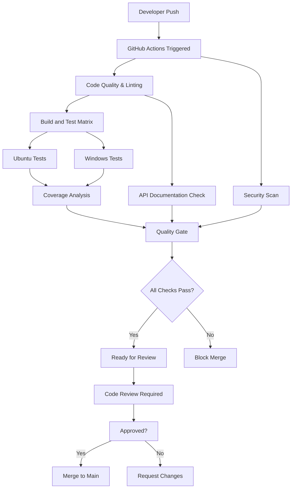

# CI/CD Setup for Event Sourcing Banking Demo

This document explains the complete CI/CD pipeline and quality gates implemented for the Event Sourcing Banking Demo project.

## 🎯 Overview

Our CI/CD pipeline ensures that only high-quality, tested code reaches the main branch through:

- **Automated quality checks** on every PR
- **Branch protection rules** preventing direct commits to main
- **Multi-stage validation** with comprehensive testing
- **Code coverage enforcement** with minimum thresholds
- **Security scanning** for vulnerabilities
- **Documentation validation** for API completeness

## 🏗️ Pipeline Architecture



## 🚦 Quality Gates

### Stage 1: Code Quality & Linting
- **Code Formatting**: `dotnet format --verify-no-changes`
- **Static Analysis**: Build with warnings as errors
- **Compilation**: Verify clean build

### Stage 2: Build and Test Matrix
- **Cross-Platform**: Ubuntu and Windows builds
- **Unit Tests**: Fast, isolated business logic tests
- **Integration Tests**: End-to-end with real dependencies
- **Coverage Threshold**: Minimum 60% overall coverage

### Stage 3: Security Scan
- **Vulnerability Scanning**: Check for known security issues
- **Dependency Audit**: Verify all packages are secure
- **Transitive Dependencies**: Include indirect dependencies

### Stage 4: API Documentation
- **XML Documentation**: Verify all public APIs documented
- **Swagger Generation**: Ensure OpenAPI spec is valid
- **Documentation Build**: Confirm docs generate successfully

### Stage 5: Quality Gate
- **Comprehensive Check**: All previous stages must pass
- **Final Validation**: Ready for human review

## 📋 Branch Protection Rules

### Main Branch Protection
- ✅ **Require pull request before merging**
- ✅ **Require approvals**: 1 reviewer minimum
- ✅ **Dismiss stale reviews** when new commits pushed
- ✅ **Require status checks to pass**
- ✅ **Require branches to be up to date**
- ✅ **Restrict pushes that create matching branches**
- ❌ **Allow force pushes** (disabled)
- ❌ **Allow deletions** (disabled)

### Required Status Checks
- `Code Quality & Linting`
- `Build and Test (ubuntu-latest)`
- `Build and Test (windows-latest)`
- `Security Scan`
- `API Documentation`
- `Quality Gate`

## 🔄 Developer Workflow

### 1. Feature Development
```bash
# Start from main
git checkout main
git pull origin main

# Create feature branch
git checkout -b feature/account-limits

# Make changes, add tests, update docs
# ... development work ...

# Test locally
dotnet test
dotnet format --verify-no-changes
dotnet build --configuration Release
```

### 2. Pull Request Creation
```bash
# Push feature branch
git push origin feature/account-limits

# Create PR via GitHub UI using our PR template
# - Fill out description
# - Link related issues
# - Mark checklist items
```

### 3. Automated Validation
- CI pipeline runs automatically
- All quality gates must pass
- Coverage reports generated
- Security scan completed

### 4. Code Review
- Automatic reviewer assignment via CODEOWNERS
- Review focuses on:
  - Event sourcing patterns
  - Business logic correctness
  - Test coverage adequacy
  - Security implications
  - Documentation completeness

### 5. Merge to Main
- All checks passed ✅
- Review approved ✅
- Branch up-to-date ✅
- Squash merge to main
- Feature branch deleted

## 📊 Monitoring and Metrics

### Quality Metrics Dashboard
- **Build Success Rate**: Target 95%+
- **Test Pass Rate**: Target 98%+
- **Code Coverage**: Target 60%+ (currently ~67%)
- **Security Vulnerabilities**: Target 0
- **PR Cycle Time**: Target <24 hours

### Coverage Tracking
- **Codecov Integration**: Dynamic badge in README
- **Coverage Trends**: Track improvements over time
- **Per-Component Coverage**: Monitor domain vs infrastructure
- **Threshold Enforcement**: Block PRs below 60%

## 🛠️ Local Development Setup

### Prerequisites Check
```bash
# Verify .NET version
dotnet --version  # Should be 8.0+

# Verify Docker
docker --version

# Verify Git
git --version
```

### Quality Tools Installation
```bash
# Install formatting tools
dotnet tool install -g dotnet-format

# Install coverage tools
dotnet tool install -g dotnet-reportgenerator-globaltool

# Install security scanning
dotnet tool install -g dotnet-outdated-tool
```

### Pre-commit Hooks (Recommended)
```bash
# Install pre-commit hook to run quality checks
cat > .git/hooks/pre-commit << 'EOF'
#!/bin/sh
echo "Running pre-commit quality checks..."

# Format check
if ! dotnet format --verify-no-changes; then
    echo "❌ Code formatting issues found. Run 'dotnet format' to fix."
    exit 1
fi

# Build check
if ! dotnet build --configuration Release; then
    echo "❌ Build failed."
    exit 1
fi

# Test check
if ! dotnet test --no-build --configuration Release; then
    echo "❌ Tests failed."
    exit 1
fi

echo "✅ All pre-commit checks passed!"
EOF

chmod +x .git/hooks/pre-commit
```

## 🚨 Troubleshooting

### Common Issues

#### 1. Status Checks Not Running
**Problem**: PR created but no status checks appear
**Solution**: 
- Check workflow file syntax
- Ensure PR targets main branch
- Verify workflow triggers on pull_request

#### 2. Coverage Check Failing
**Problem**: Coverage below 60% threshold
**Solution**:
- Add tests for uncovered code
- Check coverage report in CI logs
- Focus on domain logic first

#### 3. Format Check Failing  
**Problem**: Code formatting doesn't match standards
**Solution**:
```bash
# Fix formatting automatically
dotnet format
git add .
git commit -m "fix: code formatting"
```

#### 4. Security Scan Failing
**Problem**: Vulnerable dependencies detected
**Solution**:
```bash
# Update vulnerable packages
dotnet list package --vulnerable
dotnet add package <package-name> --version <safe-version>
```

### Getting Help

1. **Check CI Logs**: Click on failed status check for details
2. **Local Reproduction**: Run same commands locally
3. **GitHub Discussions**: Ask questions in repository discussions
4. **Issue Tracker**: Report bugs or request features

## 🎯 Best Practices

### For Contributors
- **Test Locally First**: Always run quality checks before pushing
- **Small PRs**: Keep changes focused and reviewable
- **Clear Commits**: Use conventional commit messages
- **Documentation**: Update docs for API changes

### For Reviewers
- **Timely Reviews**: Respond within 24 hours
- **Constructive Feedback**: Provide specific, actionable comments
- **Event Sourcing Focus**: Ensure patterns are followed correctly
- **Security Mindset**: Consider security implications

### For Maintainers
- **Monitor Metrics**: Track quality trends over time
- **Update Tools**: Keep CI tools and dependencies current
- **Team Training**: Ensure team understands workflow
- **Continuous Improvement**: Refine process based on feedback

## 📈 Future Enhancements

### Planned Improvements
- [ ] **Performance Testing**: Add automated performance benchmarks
- [ ] **Mutation Testing**: Verify test quality with mutation testing
- [ ] **Dependency Scanning**: Enhanced security scanning
- [ ] **Release Automation**: Automated versioning and releases
- [ ] **Environment Promotion**: Staging environment deployment
- [ ] **Monitoring Integration**: Application performance monitoring

### Advanced Features
- [ ] **Semantic Versioning**: Automated version bumping
- [ ] **Changelog Generation**: Automated release notes
- [ ] **Container Scanning**: Docker image security scanning
- [ ] **Infrastructure as Code**: Terraform for cloud resources
- [ ] **Blue-Green Deployment**: Zero-downtime deployments

---

This CI/CD setup ensures that the Event Sourcing Banking Demo maintains high code quality while providing a smooth developer experience. The combination of automated quality gates and human code review creates a robust process for collaborative development. 🚀 